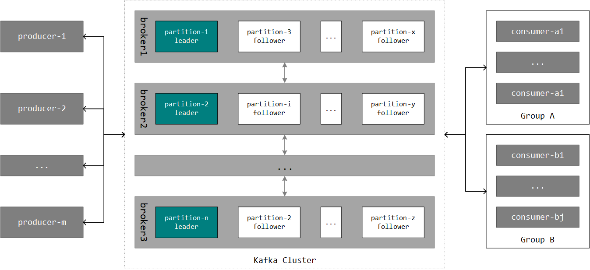
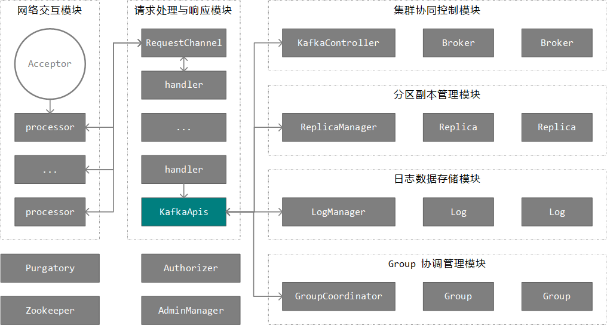

Kafka 作为分布式消息引擎系统，主要用于消息的发布订阅、日志数据的采集等，以充当一个公司的数据总线角色。因其具备优良的性能和近乎实时的消息投递能力，并且能够保证消息的顺序性、持久性和完整性（不丢消息），同时引入 topic、partition，以及 group 等精妙的设计理念，所以自开源以来社区一直非常活跃。

此外，Kafka 的流式计算模块（Kafka Streams）相对于这些流式计算引擎能够实现端到端的 Exactly-Once 语义，而其它流式计算引擎宣称的 Exactly-Once 语义仅限于框架内部，所以 Kafka Streams 未来有机会在流式计算领域占有一席之地。

#### 架构设计

Kafka 在架构设计上可以分为 producer、consumer 和 cluster 三大模块，下图展示了 producer、consumer 和 cluster 模块的交互模式:

Producer 模块的实现位于 kafka-clients 中，主要用于接收用户提交的消息数据并投递给 cluster。在老版本的实现中，Producer 默认采用同步的方式向 cluster 提交消息数据，所以吞吐量不高，而新版本（0.8.2.0 以后）的 producer 修复了异步提交导致消息数据丢失的问题，并默认采用异步的方式向 cluster 提交消息数据。新版本的 producer 对于接收到来自用户的消息数据会先缓存到消息收集器中，同时在后台维护了一个消息发送线程，该线程定期定量的向 cluster 批量投递消息数据。

Consumer 模块的实现同样位于 kafka-clients 中，主要用于从 cluster 基于 pull 模式拉取消息进行消费（相对于 push 模式而言，pull 模式虽然在实时性上要差一些，但是因为状态信息由客户端进行维护，所以服务端的压力要小很多），并维护自己消费的 offset。Consumer 具备 group 的概念，一个 group 由多个 consumer 组成，并订阅一个或多个 topic 进行消费，Kafka 能够保证位于同一个 group 中的消费者在消费同一个 topic 中的消息数据时不重复。此外，一个 group 名下的消费者区分 leader 和 follower 角色，并由 1 个 leader 和多个 follower 构成，其中 leader 消费者除了肩负同 follower 消费者一样从 cluster 拉取消息进行消费的职责外，还需要管理整个 group 名下所有消费者的状态信息，并在需要时对分配给这些消费者的分区（partition）实施再分配，以保证 1 个消费者消费尽可能少的 topic 分区，同时保证 1 个 topic 分区至多被 1 个消费者消费。

Cluster 即 kafka 的服务端，主要用于接收并持久化 producer 发来的消息数据、响应 consumer 的消息消费请求，以及控制整个集群中各个 broker 节点（可以理解为单台服务器，上面运行着一个 kafka 服务）的协同运行，下图展示了 cluster 的主要构成组件：

一个 cluster 一般由多个 broker 节点构成，Kafka 会从中选举一个 broker 节点作为 leader 角色，并通过节点上运行的 KafkaController 组件控制整个集群中各个 broker 节点的协同运行，以统一对外提供服务。就单个 broker 节点而言，Kafka 会为节点上的每张网卡绑定一个 Acceptor，用于接收来自客户端和其它 broker 节点的连接，Processor 组件会从这些连接中获取请求并交由 Handler 线程进行处理。Handler 基于 KafkaApis 组件解析具体的请求类型并分发给具体的组件，同时负责构造和发送响应结果。

除了上面提及的 KafkaController 组件，Kafka 主要还包括 LogManager、ReplicaManager 和 GroupCoordinator 几大组件。

LogManager 组件主要提供了对日志数据的加载、创建、删除，以及查询等功能，是 kafka 日志数据管理的核心组件。Kafka 依赖于本地文件系统对日志数据进行存储，为了保证日志数据的可靠性和读写的高性能，引入了副本机制、顺序读写、零拷贝，以及索引等策略，同时在后台维护定时任务对过期或过大的日志数据执行清理操作，并在允许的情况下对 key 相同的消息实施压缩。

ReplicaManager 组件主要负责管理 topic 分区的多个副本。为了避免单点问题导致的日志数据丢失，Kafka 会为每个 topic 分区设置多个副本（包含一个 leader 角色和多个 follower 角色），并将这些副本均匀分布在不同的 broker 节点上，理论上这些副本上保存的消息数据应该是一致的。ReplicaManager 提供了对这些副本的管理功能，包括副本角色切换、副本之间的消息数据同步，以及从指定 topic 分区读写日志数据等。

GroupCoordinator组件主要用于对一个grou名下的消费者进行协调。在服务运行过程中难免会出现消费者的上下线，以及分区数目的变更，GroupCoordinator 主要负责在必要时对 group 名下的消费者执行分区再分配操作，以保证消费者与 topic 分区之间分配关系的均衡性。

除了上面介绍的这些组件，Kafka 还提供了 Purgatory 组件用于管理延时任务，利用 Authorizer 组件执行权限控制，以及基于 AdminManager 组件对集群进行手动管理等。此外，Kafka 还需要依赖于 ZK 对整个集群中节点的运行达成共识。

#### 核心概念

- 分区多副本机制

Kafka 使用 topic 对消息数据进行组织，每个 topic 可以设置若干个分区，一个 topic 中的消息按照具体的分区策略分布在分区集群中。之所以 kafka 需要引入分区的概念，主要是希望利用分布式系统中的多节点来提升 kafka 集群的性能和可扩展性。因为一个 topic 的各个分区可以分布在不同的 broker 节点上，进而就能将 topic 的消息数据分散在这些 broker 节点上存储，对于消息的读写压力就可以由这些节点进行分摊。当我们感知到一个 topic 的消息读写量较大时，我们可以适当增加分区的数目来实现扩容的目的。设想如果我们不引入分区策略，而是由一个 broker 节点完整负责一个 topic，考虑每个 topic 之间的消息数据量和读写量可能存在较大差别，那么各个 broker 节点在负载均衡性上也会有较大的差异，最终影响的是集群整体的可用性。

考虑到分区内消息数据的单点问题，Kafka 为每个分区依据配置会分配多个副本，这些副本数据分散保存在不同的 broker 节点上，一个 broker 节点可以保存成百上千个属于不同 topic 分区的副本。副本分为 leader 角色和 follower 角色两类，每个 topic 分区都有一个 leader 副本，所有生产者和消费者的消息推送和拉取请求都由该副本进行响应。除 leader 副本以外的副本均为 follower 副本，follower 副本不直接处理来自生产者和消费者的请求，其唯一的任务就是从 leader 副本那里同步消息，以保持与 leader 副本的数据一致性，并在 leader 副本失效时竞争成为新的 leader 角色，以保证对应 topic 的正常运行。

理论上来说，一个 topic 分区各个副本之间的数据应该是一致的，但是考虑到网络的延迟、broker 节点的负载，以及副本角色的切换等因素，follower 副本中存储的消息数据一般滞后于 leader 副本中存储的消息数据。但是在一些场景下（一般都是因为副本角色切换），follower 副本中存储的消息数据甚至会超前于 leader 副本中存储的消息数据。

思考：为什么 kafka 在设计上仅允许 leader 副本对外提供服务，而不采用经典的读写分离策略（即允许消费者从 follower 副本读取消息）？

1.读写分离策略在 MySQL 等数据库领域被广泛应用，能够有效的解决数据库集群的负载压力，但是我们也不能忽略一个前提，即读写分离一般适用于读多写少的场景。如果是读少写多的话，那么主从复制会存在较大的延迟，并且数据库的主要压力集中在 master 节点，读写分离并不能分摊这部分负载。回到 kafka 本身，作为消息引擎，Kafka 采用发布订阅的模式运行，大部分场景下读和写是几乎是对等的，所以引入读写分离策略并不会带来较大的收益，反而会增加系统设计的复杂度。

2.此外，Kafka 可以为一个 topic 设置多个分区，这些分区的 leader 副本一般均匀分散在集群的多个 broker 节点上，所以对于同一个 topic 来说，这一设计已经做到了负载均衡。但是我们仍然不能忽视一种场景，就是一个 topic 的某个分区相对于其它分区的消息量要大很多，这在无意间增加了该分区 leader 副本所在 broker 节点的压力，此时我们能够做的就是重新设置合理的分区数目或修改分区选择策略。不过我们也不能否认读写分离策略在一些场景下仍然具备适用性，也许 kafka 的未来版本会酌情支持。

####  AR & ISR

为了保证在 broker 节点宕机时，由该节点管理的 topic 分区仍然可用，Kafka 一般会为 topic 分区分配多个副本，这些副本称为该 topic 分区的 Assigned Replicas，简称 AR 副本集合。

ISR 副本集合是指由一个 topic 分区名下的 In-Sync Replica 副本构成的集合。ISR 集合是 AR 集合的一个子集，如果 AR 集合中的副本能够同时满足以下 2 个条件则有资格加入到 ISR 集合中：

1.副本所在 broker 节点与 ZK 连接正常，即对应 broker 节点是活跃的。

2.副本持有的最新一条消息的 offset 与 leader 副本最新一条消息的 offset 之间的差值在设定阈值范围内，即 follower 副本与 leader 副本之间持有的消息数据差别不大。

ISR 集合由每个 topic 分区的 leader 副本进行维护，follower 副本在启动之后会从 leader 副本同步消息数据，当数据之间的差异逐渐变小，直到小于设定的阈值时，该 follower 副本即有资格被加入到 topic 分区的 ISR 集合中。相反，当 follower 副本因为某些原因（比如，所在 broker 节点宕机、网络异常等） 逐渐滞后于 leader 副本时，会被 leader 副本从 ISR 集合中移除，所以说 ISR 集合中的副本是一个动态变化的过程。

上一小节我们介绍了一个分区的副本由 leader 和 follower 角色之分，当 leader 副本失效时会从 follower 副本集合中竞选出一个成为新的 leader，但不是所有的 follower 副本都适合当 leader，如果某个 follower 副本与 leader 副本之间的消息同步延迟较大，那么该 follower 副本成为 leader 之后就会丢失相当一部分消息数据，而 ISR 集合中的 follower 副本就能够避免这样的问题，这主要得益于下一小节介绍的 HW 值。

思考：为什么采取 ISR 机制而非一致性协议来保证数据的一致性？

当面临需要维护多个副本的数据一致性时，我们往往会考虑引入 Paxos、Raft 一类的一致性协议，那为什么 kafka 在设计时不走寻常路呢？个人分析主要包含两方面的原因：

1.Kafka 不需要保持所有副本的数据一致性，因为 follower 副本在这里仅仅是当 leader 副本失效时竞选成为新的 leader 副本以继续提供服务，平时不响应读请求，如果维持所有副本的数据一致性势必会增加对客户端投递消息请求的响应时间（尤其是当一些 broker 节点负载较高的时候），收益不大。

2.一致性协议一般采用投票机制，如果允许 n 个副本失效，那么为了保证副本对应的 topic 分区能够继续正常运行，则至少需要设置 2n+1 个副本，也就是说我们至少需要为每个 topic 分区设置 3 个副本才允许有 1 个副本失效，副本数越多对集群的压力也就越大。对于 ISR 机制而言，如果允许 n 个副本失效，则最少只需要设置 n+1 个副本。

#### HW & LEO

HW 和 LEO 是一个副本上两个特殊的 offset 位置，其中 HW 是 High Watermark 的简写，LEO 是 Log End Offset 的简写。

LEO 的概念比较简单，每个副本都有一个 LEO 值，表示当前副本完成追加的消息的最大 offset。当生产者完成往 leader 副本追加消息时，leader 副本的 LEO 值会递增，而当 follower 副本完成从 leader 副本拉取消息时，follower 副本的 LEO 值会递增。

HW 值由 topic 分区的 leader 副本进行维护，是一个关键的位置值，消费者在消费当前 topic 分区时只能看见 HW 位置之前的消息。消费者在将消息提交给 leader 副本时一般会携带一个 acks 参数，用于指定是否需要服务端对本次请求进行确认，以及在什么情况下进行确认。如果 acks 参数设置为 -1，则表示需要 ISR 集合中的所有 follower 副本完成对当前消息的同步时，leader 副本才认为此消息被成功记录到集群，此时 leader 副本会递增 HW 值。

如果 leader 副本失效，当从 ISR 集合中选举出新的 leader 副本时，因为该副本一定保存着 HW 之前的消息数据，所以对消费者来说即使新的 leader 副本的 LEO 值小于前任 leader 副本的 LEO 值，消费者也感知不到其中的差别，因为消费者只能看见 HW 之前的消息数据。

#### Offset Topic

在之前版本的 kafka 设计中依赖 ZK 记录每个 topic 分区的消费 offset，这是一个比较直观的思路，但在实际应用中这一设计因为需要与 ZK 频繁交互，所以在性能和可用性上都受制于 ZK，对于规模较大的集群而言，ZK 面临着巨大的压力。在 0.8.2.2 版本中，Kafka 引入了 native offset storage 机制，使用内建的 topic 替代 ZK 对 offset 信息进行存储，对应的 topic 名称为 __consumer_offsets（后续的文章如果不多做说明，均使用 offset topic 进行指代），Kafka 默认为该 topic 设置了 50 个分区，并为每个分区分配了 3 个副本。为了保证数据不丢失，该 topic 的 acks 参数默认为 -1，即要求所有 ISR 集合中的 follower 副本对追加的 offset 消息进行确认。